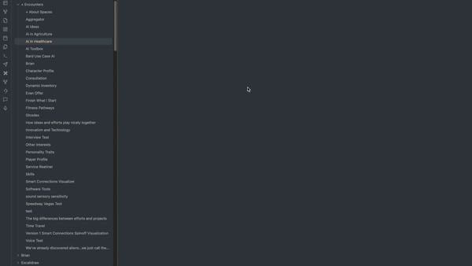

# Smart Memos v1.1

 

Welcome to the Smart Memos! This plugin integrates seamlessly with your Obsidian, offering an advanced, interactive way to transcribe and generate notes from your audio files. My goal is to enhance your ability to capture and understand information from audio sources, transforming the way you interact with and understand your information.

## Features
- **Enhanced Audio Recorder**: Record audio files directly into an Obsidian note with added functionality to pause, resume, and restart recordings. 
- **Audio Transcription**: Transcribe audio files that are either spoken directly into Obsidian or imported into a note using advanced AI models.
- **Note Generation**: Generate detailed notes in markdown language from the transcribed audio.
- **Customizable Prompts**: Customize the prompt that will be sent to the AI model before adding your transcribed audio so you can get any kind of analysis, note structure format, or enhancements you want!
- **Built in Obsidian Support**: Use the customized prompt to request formats that are supported by obsidian, such as markdown and mermaid charts as you can see in the video.
- **Support for Multiple Audio Formats**: Supports mp3, mp4, mpeg, mpga, wav, webm audio formats.

## Installation
Getting started with the Smart Memos Plugin is easy. Follow these steps to install:

1. Download and install the Smart Memos Plugin from the Obsidian Community Plugins.
2. Configure the plugin settings with your OpenAI API Key and preferred AI model.

Note* This plugin currently uses online openAI models to recieve and transcribe your voice memos.  Looking to add Local AI Models in the near future. OpenAI's retention policy retains text up to 30 days, but does not retain any audio data. 

## Platforms

- Desktop
- Mobile

## Usage
Once installed, the Smart Memos Plugin provides an intuitive interface to transcribe your audio files and generate notes.  

- **Adding Audio**: Ensure you have a note opened. To speak your memo directly into Obsidian, tap the microphone icon to open the smart memos popup that'll automatically start recording.  To import audio into a note, simply drag and drop the file into it.
- **Transcribing Audio**: To transcribe an audio file after it's been imported into a note, move your cursor right underneath the audio file and use the command `Smart transcribe` from the command palette (`Ctrl + p` for Windows and `Cmd + p` for Mac). The plugin will transcribe the audio file and generate detailed notes. If you're speaking directly to Obsidian, you can select the "Smart Transcribe" button to transcribe what you've recorded.
- **Customizing the Prompt**: You can customize the prompt that will be sent to the AI model before adding your transcribed audio in the plugin settings.
- **Include Raw Transcript**: If you just want clean notes returned, you can remove the addition of the raw transcript at the end by toggling it off in the settings

Note* This plugin finds your audio file by looking at what you have set at the "Default location for new attachments" within the "Files and Links" tab of Obsidian settings.  If your audio file is for some reason not stored at the location specified, you should move it there.  I will see about a workaround for missplaced audio files.

## Vision
The Smart Memos plugin aims to revolutionize the way we capture and understand information from audio sources. By leveraging advanced AI models, the plugin can transcribe audio files and generate fully customizable notes, in-depth analysis, and idea expansion, freeing you from the tedious task of manual transcription and note-taking, while simultaneously expanding upon them to allow your two "brains" to work harmoneously.

The ultimate mission is to enhance productivity, ideas, and efficiency in note-taking, especially for users who frequently deal with audio sources of information or find it much easier to simply speak whatever is on their mind than write it all down. With this plugin, I envision a future where valuable information from audio sources doesn't get lost and is automatically integrated into your own, personalized way of note-taking.

## About Me
Hello there! Name's Evan 😁

I'm a senior software developer/architect consultant, currently managing and developing data visualization tools for the CDC. I've been obsessed about what's transpiring with AI for the last 12-ish years, fully aware that it would soon completely change the world.

Inspired by Brian, the creator of Smart Connections, I started an AI consulting company called "Evan's Oasis." At Evan's Oasis, I audit business workflows for clients and recommend AI tools and practices that significantly enhance decision-making, productivity, and quality—while reducing the time and money needed to run a business.

## Community and Support
Your involvement is crucial to the evolution of Smart Memos. From troubleshooting issues to suggesting new features, every contribution enriches our community and drives the project forward!

- **Join The Community**
  - GitHub Discussions: Participate in discussions on GitHub to share your experiences and ask questions.
  - Contribute: Help develop the plugin, report issues, or suggest new features.
  - User Testimonials: Share how the plugin has impacted your workflow and creativity.

## License
The Smart Memos Plugin is open-source and available under the MIT License. Contributions are welcome!

Feel free to reach out with any questions or suggestions. I hope this plugin enhances your note-taking experience and helps you uncover new insights and connections within your notes. Happy transcribing!
