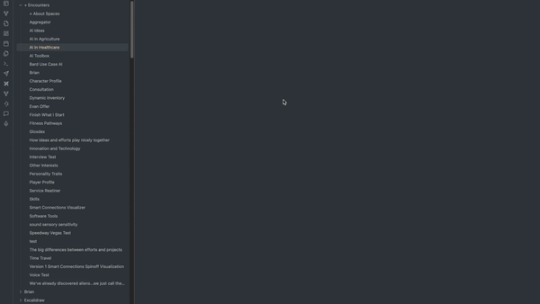

# Smart Memos v1.2

 

Welcome to the Smart Memos! This plugin integrates seamlessly with your Obsidian, offering an advanced, interactive way to transcribe and generate notes from your audio files. My goal is to enhance your ability to capture and understand information from audio sources, transforming the way you interact with and understand your information.

## Features
- **Enhanced Audio Recorder**: Record audio files directly into an Obsidian note with added functionality to pause, resume, and restart recordings. 
- **Flexible Recording Interface**: Choose between traditional modal recording or non-intrusive status bar controls that let you continue working while recording.
- **Multiple AI Providers**: Support for OpenAI and Google Gemini - choose the provider that best fits your needs and requirements.
- **Audio Transcription**: Transcribe audio files that are either spoken directly into Obsidian or imported into a note using advanced AI models.
- **Note Generation**: Generate detailed notes in markdown language from the transcribed audio using your chosen AI provider.
- **Customizable Prompts**: Customize the prompt that will be sent to the AI model before adding your transcribed audio so you can get any kind of analysis, note structure format, or enhancements you want!
- **Built in Obsidian Support**: Use the customized prompt to request formats that are supported by obsidian, such as markdown and mermaid charts as you can see in the video.
- **Support for Multiple Audio Formats**: Supports mp3, mp4, mpeg, mpga, wav, webm audio formats.

## Installation
Getting started with the Smart Memos Plugin is easy. Follow these steps to install:

1. Download and install the Smart Memos Plugin from the Obsidian Community Plugins.
2. Configure the plugin settings with your preferred AI provider:
   - **OpenAI**: Enter your OpenAI API Key (supports Whisper transcription and GPT text generation)
   - **Google Gemini**: Enter your Gemini API Key (supports both audio transcription and text generation)

**Note** Both OpenAI and Google Gemini support audio transcription and text generation. OpenAI uses Whisper for transcription, while Gemini has built-in audio processing capabilities. 

**Another Note:** If you have the native record feature in Obsidian turned on, it must be turned off for audio to record using Smart Memos.

## Platforms

- Desktop
- Mobile

## Usage
Once installed, the Smart Memos Plugin provides an intuitive interface to transcribe your audio files and generate notes.  

- **Recording Interface**: Choose your preferred recording experience in settings:
  - **Modal Interface** (default): Full-screen recording modal with all controls visible
  - **Status Bar Interface**: Compact controls in the status bar that don't interrupt your workflow - continue editing notes while recording!
    - **Smart Note Targeting**: Configure how recordings target specific notes (always remember current note, ask each time, or never remember)
    - **Customizable Position**: Place recording controls anywhere in the status bar (far left, left, center, right, far right)
- **Adding Audio**: To speak your memo directly into Obsidian, tap the microphone icon that displays "Record smart memo" or select `Record smart memo` from the command palette (`Ctrl + p` for Windows and `Cmd + p` for Mac). With modal interface, this opens the smart memos popup. With status bar interface, recording controls appear in the status bar at the bottom of Obsidian.  To import audio into a note, simply drag and drop an audio file into it.
- **Transcribing Audio**: To transcribe an audio file after it's been imported into a note, move your cursor right underneath the audio file and use the command `Smart transcribe` from the command palette. The plugin will transcribe the audio file and generate detailed notes using your selected AI provider. If you're speaking directly to Obsidian, you can select the "Smart Transcribe" button to transcribe what you've recorded.
- **AI Provider Selection**: Choose between OpenAI and Google Gemini in the plugin settings based on your needs and model preferences.
- **Customizing the Prompt**: You can customize the prompt that will be sent to the AI model before adding your transcribed audio in the plugin settings.
- **Include Raw Transcript**: If you just want clean notes returned, you can remove the addition of the raw transcript at the end by toggling it off in the settings
- **Specify where audio files are recorded in your vault**: By default, audio recordings will be saved to your root vault folder.  If you want to store audio recordings in a specific folder, you can change it in the settings of this plugin. I.e if you want them to be saved in a 'Recordings' folder within your 'Resources' folder, you can set the settings value to Resources/Recordings.

## Recent Updates
- ✅ **Multiple AI Providers**: Added support for Google Gemini in addition to OpenAI (both support audio transcription and text generation)
- ✅ **Status Bar Recording**: Non-intrusive recording interface that doesn't block your workflow
- ✅ **Smart Note Targeting**: Remember target notes for seamless transcription workflow - transcriptions append to intended notes even when navigating away
- ✅ **Customizable Status Bar Position**: Place recording controls exactly where you want them in the status bar
- ✅ **Streamlined Controls**: Clean interface with Record/Pause and Stop & Transcribe buttons

## Coming Soon(ish)!
- **Smart Templates**: Given the seemingly infinite use cases, I'm working with Brian (creator of smart connections) to integrate "Smart Templates", a templating feature that will be available in Obsidian within the coming weeks.
- **Local Model Transcription**: Working on supporting local transcription models like Whisper.cpp to complement the existing local text generation via Ollama. 

## Vision
The Smart Memos plugin aims to revolutionize the way we capture and understand information from audio sources. By leveraging advanced AI models, the plugin can transcribe audio files and generate fully customizable notes, in-depth analysis, and idea expansion, freeing you from the tedious task of manual transcription and note-taking, while simultaneously expanding upon them to allow your two "brains" to work harmoneously.

The ultimate mission is to enhance productivity, ideas, and efficiency in note-taking, especially for users who frequently deal with audio sources of information or find it much easier to simply speak whatever is on their mind than write it all down. With this plugin, I envision a future where valuable information from audio sources doesn't get lost and is automatically integrated into your own, personalized way of note-taking.

## About Me
Hello there! Name's Evan 😁

I'm a senior software developer/architect consultant, currently managing and developing data visualization tools for the CDC. I've been obsessed about what's transpiring with AI for the last 12-ish years, fully aware that it would soon completely change the world.

Inspired by Brian, the creator of Smart Connections, I started an AI consulting company called "Evan's Oasis." At Evan's Oasis, I audit business workflows for clients and recommend AI tools and practices that significantly enhance decision-making, productivity, and quality—while reducing the time and money needed to run a business.

## Community and Support
Your involvement is crucial to the evolution of Smart Memos. From troubleshooting issues to suggesting new features, every contribution enriches our community and drives the project forward!

- **Join The Community**
  - GitHub Discussions: Participate in discussions on GitHub to share your experiences and ask questions.
  - Contribute: Help develop the plugin, report issues, or suggest new features.
  - User Testimonials: Share how the plugin has impacted your workflow and creativity.

## License
The Smart Memos Plugin is open-source and available under the MIT License. Contributions are welcome!

Feel free to reach out with any questions or suggestions. I hope this plugin enhances your note-taking experience and helps you uncover new insights and connections within your notes. Happy transcribing!
